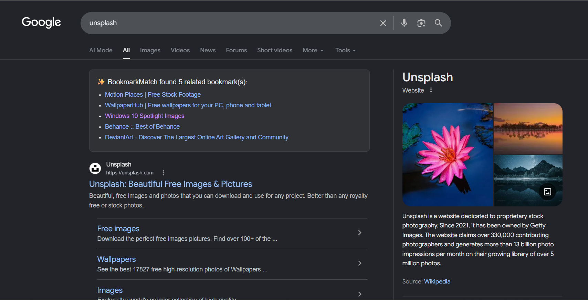

  
  
  # ✨ BookmarkMatch (Powered with AI)
  **An easy way to find relevant bookmarks on search engines.**

 

BookmarkMatch is a smart Chrome Extension that acts as a second brain for your saved links. Whenever you search for a topic on Google, this extension instantly searches your saved Chrome bookmarks and displays relevant matches right at the top of your search results. 

It works immediately out-of-the-box using an advanced, Boolean-based local search engine. Want even smarter results? Link a free Gemini API key to semantically match the *intent* of your search!

  

## 🚀 Features
* **🔍 Advanced Local Search (No API required):** Works instantly offline! Uses an "Everything-style" strict Boolean engine for power users (see syntax below).
* **🧠 AI-Powered Semantic Search (Optional):** Link a Gemini API key to go beyond exact words. The AI understands the context and intent of your search for magical accuracy.
* **👻 Non-Intrusive UI:** Blends natively into Google Search (supports Light & Dark mode) and stays completely hidden if no matches are found.
* **🛡️ Privacy First:** Your bookmarks never leave your browser unless you explicitly choose to enable the AI API key.
* **⚙️ Customizable:** Turn the extension on/off and choose exactly how many matches to display via the popup menu.

## ⌨️ Advanced Local Search Syntax
If you are using BookmarkMatch *without* an API key, the local engine acts like a strict developer tool (inspired by the "Everything" search engine). You can use operators directly in your Google search to precisely filter your bookmarks:

* **`Space` (AND):** `windows debloat` (Matches if it contains *both* "windows" and "debloat").
* **`" "` (Exact Phrase):** `"windows 11"` (Matches only if the words appear in that exact order).
* **`!` (NOT):** `github !linux` (Matches "github", but strictly *excludes* any bookmark containing "linux").
* **`|` (OR):** `windows debloat|privacy` (Matches "windows", and must contain *either* "debloat" or "privacy").

*Note: Once filtered, the engine scores the surviving bookmarks based on title relevance and keyword weight to ensure the absolute best matches float to the top.*

## 🛠️ How to Install
Since this extension is not on the Chrome Web Store yet, you can install it manually in Developer Mode.

1. Download or clone this repository to your computer.
2. Open Google Chrome and go to `chrome://extensions/`.
3. Turn on **Developer mode** (toggle switch in the top right corner).
4. Click the **Load unpacked** button in the top left.
5. Select the folder where you downloaded this code.

## ⚙️ Setup Instructions
1. Pin the extension to your Chrome toolbar.
2. Click the ✨ BookmarkMatch icon.
3. **(Optional but recommended)** Get a free API key from [Google AI Studio](https://aistudio.google.com/).
4. Paste your API key into the extension menu and click **Save**.
5. Go to Google and search for something you have bookmarked!

## 💻 Tech Stack
* HTML / CSS / JavaScript
* Chrome Extensions API (Manifest V3 / Storage / Bookmarks)
* Advanced Boolean Search Algorithm
* Google Gemini API (gemini-3.6-flash)
